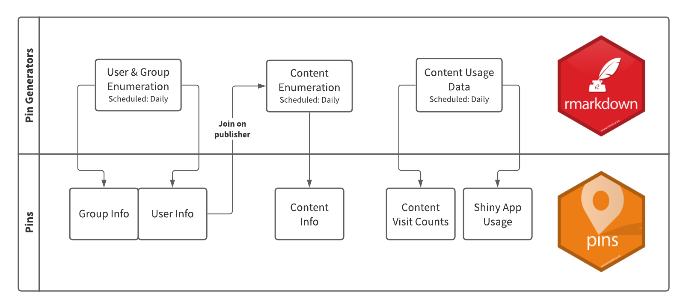

# rsc-audit-reports
Content Audit Reports built using the RStudio Connect Server API (1.8.6+)

### Pins

- **Users & Groups** Create (2) Pins, one for User list information `/v1/users` and one for Group list information `/v1/groups`, to be used in downstream audit reports
- **Content List** Create a pinned version of the `/v1/content` response generated with an Admin API key

### Report Templates

- Basic content audit report
- Basic content audit report (with custom email template)
- Content permissions (access settings) audit report
- R & Python version usage report 
- Unpublished content item audit report
- Vanity URL usage audit report
- Tag usage audit report