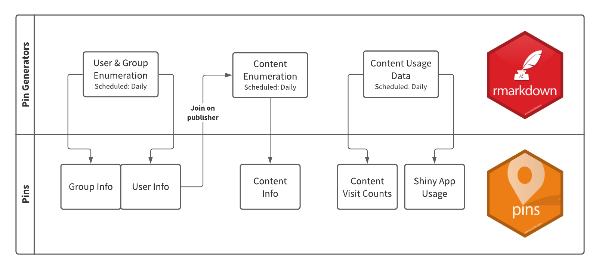

Using the RStudio Connect Server API, administrators can create scheduled reports to track and manage the content on their servers. These reports are highly customizable and make calls to the RSC Server API directly, or join/pull data from an available Pin. 



**Pin Generators** are run on a daily basis. They require an Admin API Key to pull complete data from the RStudio Connect server, and as the name suggests, they produce Pins. 

As a **Publisher**, you may request access to any **Pins** you need for generating reports relevant to your team's KPIs. For more complex auditing tasks, you may want to create your own Pins and Pin Generators that run on a schedule. Decomposing the steps of an audit report into Pins can be beneficial when components need to be reused across multiple reports, or to keep overall code complexity in check. The drawback is decomposition can increase the complexity required to schedule report execution to occur in the correct sequence.

```{r include=FALSE}
library(rscpages)
library(dplyr)

all_content <- connect() %>% content() 
```

## Audit Report Framework {.tabset}

### Pins

**Click through to be redirected to a Pin (including preview and access instructions) on RStudio Connect.**

**Access Request Notes:** Publishers may request viewer access to these content items; collaborator access requests will be denied. Viewer access will grant the permission level required to pull a Pin and make use of it in another report.

```{r}
all_content %>%
  filter(
    owner_username == 'kelly.obriant',
    content_category == 'pin'
  ) %>%
  arrange(desc(created_time)) %>%
  rscpages()
```


### Pin Generators

**Access Request Notes:** Publishers may request viewer access to these content items; collaborator access requests will be denied. 

```{r}
all_content %>%
  filter(
    owner_username == 'kelly.obriant',
    app_mode == 'rmd-static',
    stringr::str_detect(title, pattern = 'generator')
  ) %>%
  arrange(desc(created_time)) %>%
  rscpages()
```


## Example Audit Reports {.tabset}

### Admin Reports

**Use the report templates to answer questions like...**

- How do I produce a list of all the content we have published to RStudio Connect?
- Which applications can be accessed by which people and which groups?
- Which versions of R and Python are actually being used, and by which publishers?
- How much unpublished content is on the server?
- Which vanity URLs do we have in use across the server, and how do I list them out?

**Administrators Only:** Give yourself collaborator permissions on any existing report to be added to the scheduled email digest or accompanying conditional alert.

```{r}
all_content %>%
  filter(
    owner_username == 'kelly.obriant',
    app_mode == 'rmd-static',
    stringr::str_detect(title, pattern = 'audit')
  ) %>%
  arrange(desc(created_time)) %>%
  rscpages()
```

### Publisher Reports 

**Common Publisher Reports...**

- Build a report that tracks content visit data for all the content you own & collaborate on.
- Build a dashboard to view usage data for all the content your group manages.

1. Request access to the content visit or content usage data Pins.
2. Get the report template from GitHub: [Example](https://github.com/sol-eng/connect-usage)
3. Follow the instructions on the template to access and filter the Pin using your own RSC API key.
4. Publish your new report or dashboard to Connect and schedule it to run daily or weekly. The Pins are only run daily, so scheduling your content to run more frequently will not result in updated data. 


